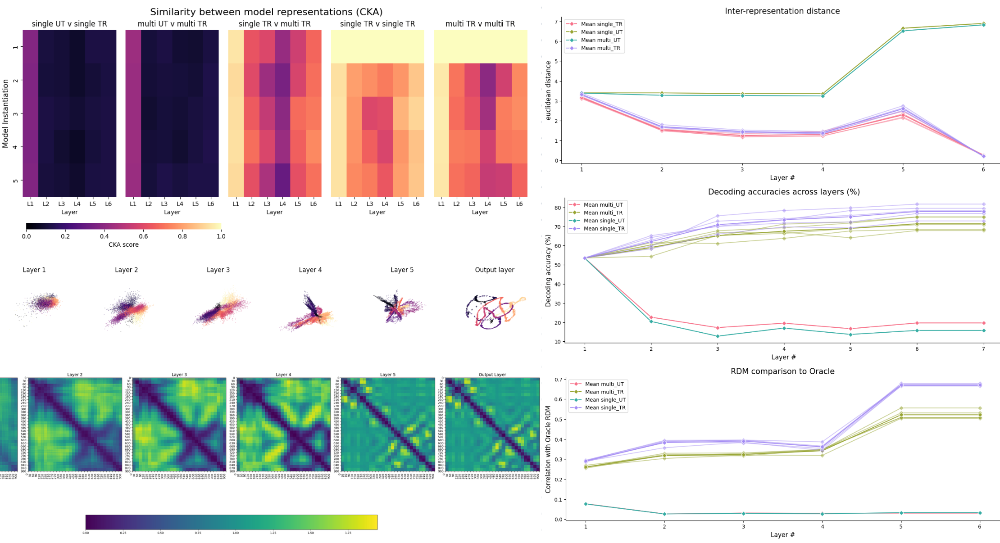

# CEBRA-Lens

## A python library for mechanistic interpretability of CEBRA models


**CEBRA-Lens** is a Python library for analyzing and interpreting neural representations learned by models trained with [CEBRA](https://github.com/AdaptiveMotorControlLab/cebra). It provides tools for mechanistic interpretability, allowing users to probe, visualize, and understand the structure of learned embeddings. The library is designed to support in-depth analysis of representational geometry, feature selectivity, and latent space dynamics in neuroscience and beyond. 👋 We welcome contributions and will continue to expand the library in the coming years.

[🦓🔎 CEBRA Lens](https://github.com/AdaptiveMotorControlLab/CEBRA-lens)

## 🛠️ Quick start

🚨 Make sure that the environment in which you trained the CEBRA models in **has the same torch version** as the environment used for CEBRA-Lens.

```{Hint} Familiar with python packages and conda? Quick Install Guide:
```bash
conda create -n CEBRAlens python=3.12
conda activate CEBRAlens
conda install -c conda-forge pytables==3.8.0

# install PyTorch with your desired CUDA version (or for CPU only)- check their website: https://pytorch.org/get-started/locally/
# example: GPU version of pytorch for CUDA 11.3
conda install pytorch cudatoolkit=11.3 -c pytorch

# install CEBRA and CEBRA-lens
pip install --pre 'cebra[datasets,demos]
pip install -- cebralens
```

## 🦓🔍 Analysis Methods

Implemented mechanistic interpretability methods for neural representation analysis are presented below.

### Model performance analysis

- Model decoding metrics:
    - average $R^2$ score across labels
    - $R^2$ score per label
    - error score per label

Additionally, there is the possibility to analyze the decoding performance of each layer embeddings.

### Layer visualizations

- single unit activation - plotting the activation value for each neural network unit
- high-dimensional embedding of population activity - 3D scatter plot using the first 3 dimensions
- low-dimensional embedding of population activity with a 3 component tSNE ([Cai & Ma, arXiv, 2022](https://arxiv.org/abs/2201.00005))

### Population level comparison

- Central Kernal Alignment (CKA) ([Kim et al., arXiv, 2022](https://arxiv.org/abs/2210.16156))

    This method allows for the comparison of corresponding layers for different models.

- Representational Dissmilarity Matrix (RDM) ([Kriegeskorte et al., Frontiers in Systems Neuroscience, 2008](https://www.frontiersin.org/journals/systems-neuroscience/articles/10.3389/neuro.06.004.2008/full))

    This method investigates population-level representations in competing models. This is done by calculating the correlation or cosine distance for each stimuli between the embeddings of a particular layer of a model.
    Possible plots for this analysis:
    - plot model layer RDM
    - plot correlation with Oracle RDM across layers

### Distance metrics
These analyses quantify the change in the distance calculated per layer in a model. The distances which are implemented in this codebase are:
- intra-class distance
- inter-class distance
- inter-repetition distance (only relevant if the model was trained on a dataset where there is repeating stimuli)



# Demo

The current version of CEBRA-Lens supports specific analysis on the Allen Institute visual coding dataset ([DeVries et al, Nature Neuro., 2020](https://www.nature.com/articles/s41593-019-0550-9)) and Hippocampus dataset ([Grosmark & Buzáki, Science, 2016](https://www.science.org/doi/full/10.1126/science.aad1935)), and for general analysis on other datasets. See the example notebooks we provide.

## 📊Usage

The CEBRA-Lens package allows for analyzing the embeddings of CEBRA models, but also offers the functionality of comparing embeddings and behavior through layers between models. For this purpose the code logic is centered around "metric classes". Before every analysis you first must initalize the corresponding metric class with the necessary arguments, and then to compute the metric the overhead function `compute_metric(data, metric_class)` needs to be called, this is the same for plotting, `plot_metric(data, metric_class)`.
For example:

```
interbin_class = lens.Distance(
data=train_data,
label=train_label,
dataset_label=dataset_label,
metric=metric,
distance_label="interbin",
)
interbin_dict = lens.compute_metric(
    activations_dict,
    interbin_class
)
fig = lens.plot_metric(
    interbin_dict, 
    interbin_class, 
    title="Inter-bin distance"
)
```

#### Jupyter Notebooks
- UsageDemoVISUAL: analysis on the Allen visual dataset, [here](https://github.com/AdaptiveMotorControlLab/CEBRA-lens/blob/main/demos/UsageDemoVISUAL.ipynb).
- UsageDemoGENERAL: analysis on the Hippocampus dataset, but without specific dataset functions, [here](https://github.com/AdaptiveMotorControlLab/CEBRA-lens/blob/main/demos/UsageDemoGENERAL.ipynb).

These two notebooks showcase the different approach when analyzing a pre-defined dataset and a non-defined dataset.


# Acknowledgements

- This repository contains the code for [Eloise's](https://github.com/eloisehabek) semester's project "Engineering software for neural representation analysis"(SPRING 2025),
  building on [Riccardo's](https://github.com/riccardoprog) semester project "Exploring nonlinear encoders for robust vision decoding" (FALL 2024).
- The work was supervised by [Célia Benquet](https://github.com/CeliaBenquet) and [Mackenzie](https://github.com/MMathisLab) at the Mathis Laboratory of Adaptive Intelligence.
- We thank the [DeepDraw project](https://elifesciences.org/articles/81499) for some [source code](https://github.com/amathislab/DeepDraw) and analysis methods.

# Other helpful tips:

## 📥 Download dataset

The `utils.py` file contains a overarching `get_data` function which checks for a pre-defined dataset label and accordingly loads the data based on specific functions for the dataset. If you want to load data from a non-defined dataset, you need to first import the loading function inside the `utils.py` file as so:
```
from .utils_new import get_datasets as get_datasets_new
```
then add an if clause for your new dataset:
```
elif dataset_label == "new_dataset":
        return get_datasets_new(session_id=session_id)
```
This is briefly repeated in the usage demo notebooks.

# Contributing Guide

### Steps to Contribute

1. **Fork the repository** and create a new branch:
   ```bash
   git checkout -b your-feature-name
   ```

2. **Make your changes** and ensure they are well-tested.

3. **Format your code** using `isort` and `black`:
   ```bash
   isort .
   black .
   ```
4. **Open a Pull Request** to the `main` branch with a clear description of your changes.
