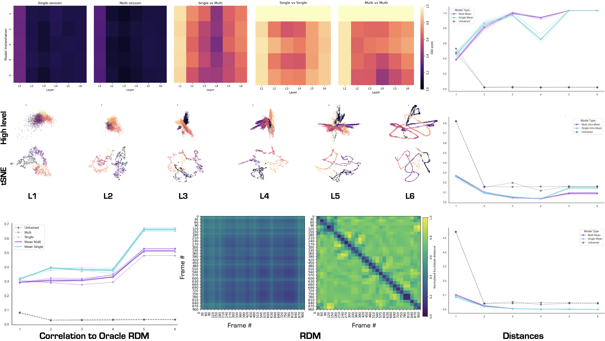

# 📚 Repository organization
This Github repository contains scripts, notebooks and package code without the Models and the Data. The data can be found [here](https://figshare.com/s/60adb075234c2cc51fa3?file=36869049) and an example usage of the data can be found in this [demo](https://cebra.ai/docs/demo_notebooks/Demo_Allen.html). 

The `demos` folder contains two notebooks:
- `ModelGenerator.ipynb` which was used to generate the models for the demo analysis notebook. It is meant to be run on Colab and was thus not scripted.
- `Demo-Notebook.ipynb` contains the demo that goes over the whole package. It is more descriptive than the scripts and more flexible. This is the reference for understanding how the functions work.

The `cebra_lens folder contains the package build to replicate the analysis on the same or different models.

Note: The notebooks that reproduce exactly the results of the report have been deleted because cleaning them would have been too time consuming and the results can be now reproduced using the package. Analysis such as GLMs were not pushed far enough to be kept in this final version of the repository and have thus been deleted. 
All these notebooks can still be found travelling back to the commit [f89dd1b](https://github.com/AdaptiveMotorControlLab/riccardo_workspace/tree/f89dd1b801144912348e414c53dc21e9b5c6c937).